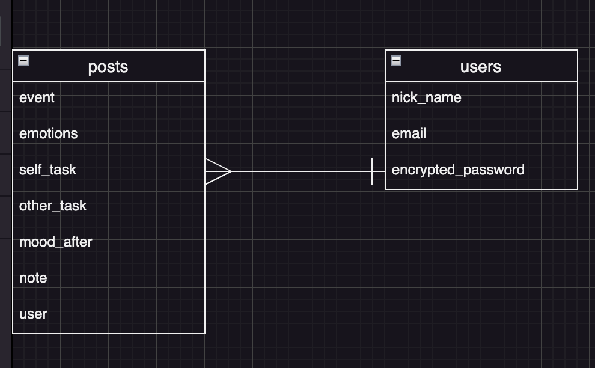
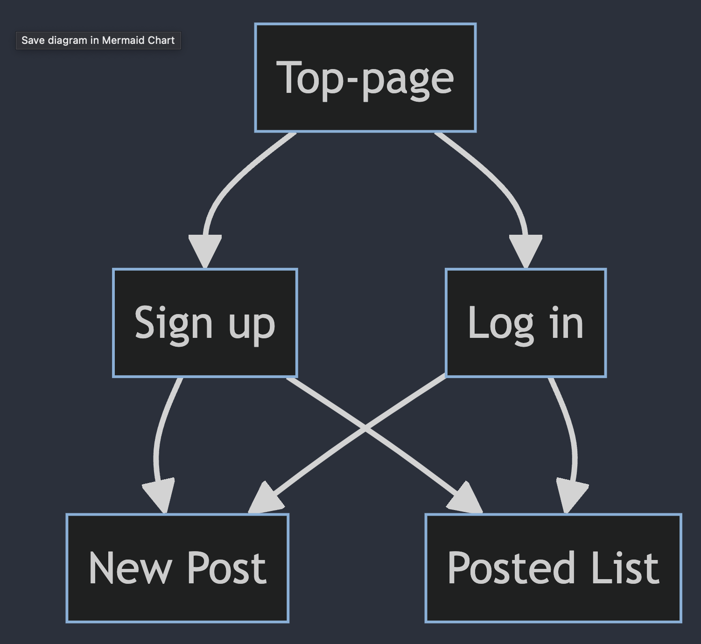

# README

# 目次
- アプリケーション名
- 概要, URL, テスト用アカウント
- 機能
- ER図
- 使い方
- 制作背景
- テーブル設計
- 画面遷移図
- 開発環境
- その他

# アプリケーション名
Self Reflection App

# 概要
自分の感情がうごいたできごとを記録するツールです。

# URL
https://oselfref.onrender.com

# テスト用アカウント

## Basic認証 
- 履歴書に記載

## Test用アカウント
- email: test@test.com
- pass: 3.14159

# 使い方
アカウントを作成されていない方は、新規登録してください。
アカウントをお持ちの方は、ログインしてください。

感情が揺れた時、フォームを入力して自分の感情を認識できます。
保存したデータはCSV出力できます。

# アプリケーションを作成した背景

友人も自身も、自分のこととなると冷静な判断ができなくなります。
言語化し記録することでまずは内省をおこなう。
さらにAIに分析してもらえば、自分自身の思考の癖がわかり
どのように考えることが自分にとってよいのか教えてもらえます。

# 機能（実装すみ）
- ユーザー登録とログイン
- 投稿の作成、一覧表示、CSV出力

# 機能（実装予定）
- CSV出力範囲設定
- 分析機能
- 感情の度合いを数値で表示
- AIとの連携（API）
- セキュリティ機能強化
- プライバシーポリシー

# ER図

# テーブル設計

## users テーブル

| Column             | Type      | Options                     |
| ------------------ | --------- | --------------------------- |
| nickname           | string    | null: false, unique: true   |
| email.             | string    | null: false, unique: true   |
| encrypted_password | string    | null: false                 |
| created_at         | datetime  | null: false                 |
| updated_at         | datetime  | null: false                 |

### Association

- has_many :posts
- has_many :passkeys

## posts テーブル

| Column     | Type       | Options                        |
| ---------- | ---------- | ------------------------------ |
| event      | text       | null: false                    |
| emotions   | text       | array: true, default: []       |
| self_task  | text       | null: false                    |
| other_task | text       | null: false                    |
| mood_after | text       | null: false                    |
| note       | text       |                                |
| user       | references | null: false, foreign_key: true |
| created_at | datetime   | null: false                    |
| updated_at | datetime   | null: false                    |

### Association

- belongs_to :user

## passkeys テーブル

| Column      | Type       | Options                        |
| ----------- | ---------- | ------------------------------ |
| user        | references | null: false, foreign_key: true |
| external_id | string     | null: false, unique: true      |
| public_key  | string     | null: false                    |
| sign_count  | integer    | null: false, default: 0        |
| label       | string     | null: false, default: "My Passkey" |
| created_at  | datetime   | null: false                    |
| updated_at  | datetime   | null: false                    |

### Association
- belongs_to :user

# 画面遷移図（passkey 実装後修正）

graph TD;
    A[Top-page] --> B[Sign up];
    A[Top-page] --> C[Log in];
    B --> D[New Post];
    B --> F[Posted List];
    C --> D[New Post];
    C --> F[Posted List];
    B --> G[Passkey Registration];
    C --> G[Passkey Registration];

# 開発環境
- Ruby on rails (version 7.0.0)
- Ruby (version 3.2.0)

# その他
## 工夫したポイント
- スマートフォン操作前提のU/Iにしました。

## 改善点
- 質問内容は、適宜アップデートします。

## セキュリティ設定
- デフォルト設定
XSS 対策
CSRF対策
SQL インジェクション対策
セッション管理 

- 手動設定
ログ出力防止
パスキー認証

