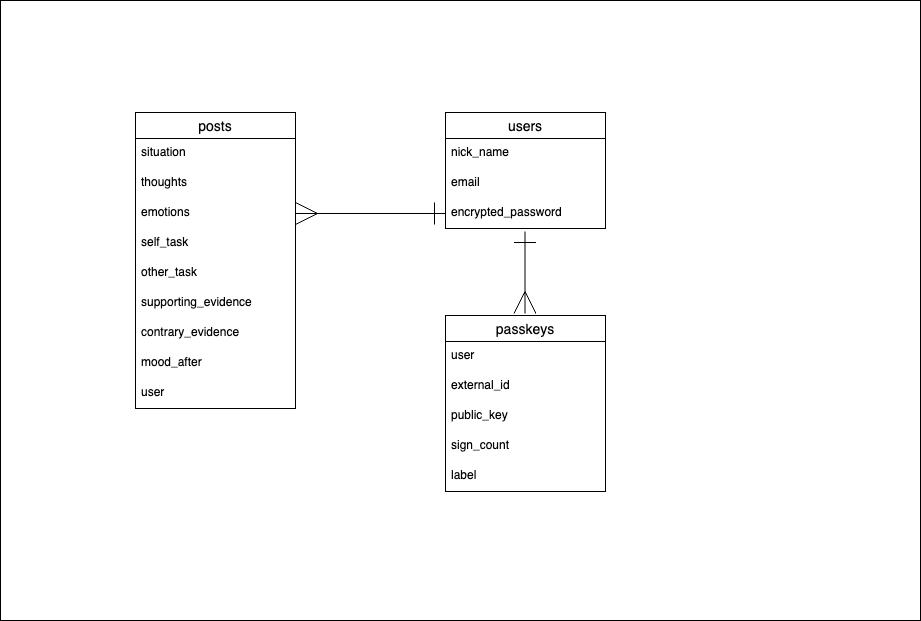

# README

# 使用技術（現在）
| カテゴリ         | 使用技術                                |
| ----------------| --------------------------------------|  
| バックエンド      | Ruby (3.1.2)，Ruby on rails (7.0.8.4)  |
| フロントエンド    | Ruby (3.1.2)  　　                      |
| データベース 　　　| PostgreSQL                             | 
| 環境構築         | Docker                                 | 
| インフラ         | Render                                 | 

# 使用技術（未来。段階的に移行！！）
| カテゴリ         | 使用技術                                |
| ----------------| --------------------------------------|  
| バックエンド      | Ruby (3.1.2)，Ruby on rails (7.0.8.4)  |
| フロントエンド    | Typescript, React                      |
| データベース 　　　| PostgreSQL                             | 
| 環境構築         | Docker                                 | 
| インフラ         | AWS   　                               | 
| CI/CD           | Github Actions                         |

# アプリケーション名（仮）
「嫌われる勇気実践アプリ」

# アプリケーション概要
- 世界的なベストセラー「嫌われる勇気」（アドラー心理学）の考え方である、”課題の分離”を実践するアプリです。
- あらかじめ設定された質問に記述式で回答します。
- 自分が変えられること、変えられないことを認識できます。

# URL
https://oselfref.onrender.com

# テスト用アカウント

## Basic認証 
- 履歴書に記載

## Test用アカウント
- email: test@test.com
- pass: 3.14159

# 使い方
新規登録／ログインをしてください。
新規投稿ボタンをおして質問に回答します。

# アプリケーションを作成した背景
日常生活の中で直面する大小様々な課題に対し、テクノロジーを活用した解決策を模索しました。
その中で、利便性向上・健康維持・快楽の追求などは手段にすぎず、その究極の目的は「幸せを感じること」であるとの結論に至りました。
幸・不幸感は、外部の環境や自分の考え方、視点によって左右されます。
しかし、外部の環境を常に自分の思い通りにすることは難しいため、自分の考え方を変えることに焦点をあてることにしました。

# 機能（実装すみ）
- ユーザー登録とログイン
- 投稿の作成、一覧表示（ページネーション）、CSV出力

# 機能（実装予定）
- CSV出力範囲設定
- 感情の度合いを数値で表示
- AIとの連携（API）
- セキュリティ機能強化

# ER図

# インフラ構成図

graph TD;
    A[Top-page] --> B[Sign up];
    A[Top-page] --> C[Log in];
    B --> D[New Post];
    B --> F[Posted List];
    C --> D[New Post];
    C --> F[Posted List];
    B --> G[Passkey Registration];
    C --> G[Passkey Registration];

# その他

## セキュリティ設定
- デフォルト設定
XSS 対策
CSRF対策
SQL インジェクション対策
セッション管理 

- 手動設定
ログ出力防止
パスキー認証

